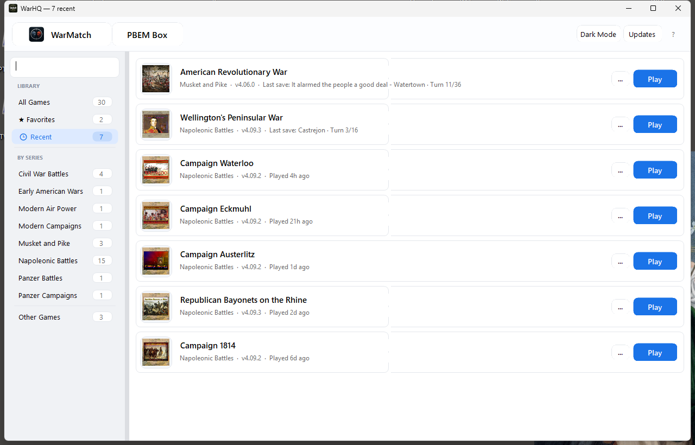

WarHQ is a Windows companion app for Wargame Design Studio players. It discovers installed WDS titles, launches games from a single Library, and supports PBEM workflows through WarMatch or PBEM Box.

Use this page when you want the shortest reliable path from download to your first launched game or PBEM turn.

## Before you start

You need:

- Windows 10 or newer.
- At least one installed Wargame Design Studio title.
- An internet connection if you plan to use WarMatch.
- Access to your email app if you plan to use manual PBEM.

## Install WarHQ

1. Download the latest installer: [Download WarHQ](https://github.com/makingwargames/warhq/releases).
2. Run the installer.
3. Open WarHQ from the Start menu or desktop shortcut.

Success looks like the WarHQ Library opening without an error dialog.

## Find your games

WarHQ discovers Wargame Design Studio games from your Windows registry. If a game is installed but missing from the Library, restart WarHQ after installing or updating the game.

Success looks like your WDS series in the left sidebar and game rows in the main Library view.

## Open a game

1. Select a series in the sidebar.
2. Search or scroll to the title you want.
3. Use the launch button on the game row.

## Choose your PBEM path

| Goal | Use | Start here |
| --- | --- | --- |
| Find opponents and exchange supported turns through the cloud | WarMatch | [WarMatch tutorial](../tutorials/warmatch/) |
| Manage local save files, mail imports, and email drafts yourself | PBEM Box | [PBEM Box tutorial](../tutorials/pbem-box/) |
| Just launch and play installed WDS games | Library | Stay on this page |

## First five-minute checklist

- WarHQ opens from the Start menu or desktop shortcut.
- Your installed WDS titles appear in the Library.
- At least one game launches from WarHQ.
- WarMatch opens and signs in if you want cloud PBEM.
- PBEM Box opens if you want manual PBEM file handling.

## If something does not work

| Problem | First thing to try |
| --- | --- |
| A WDS title is missing | Open that game once from its normal shortcut, close it, then restart WarHQ. |
| WarMatch will not connect | Confirm your internet connection, then sign out and back in. |
| Email drafts open in the wrong app | Check the default email app in Windows settings. |
| You are not sure what to send support | Include your WarHQ version, Windows version, WDS game title, and the exact step that failed. |

## Keep handy

- [Troubleshooting](../troubleshooting/)
- [Useful links](../useful-links/)
- [WarHQ Discord](https://discord.gg/rCpZwWJExb)
- [Email support](mailto:makingwargames@gmail.com)
