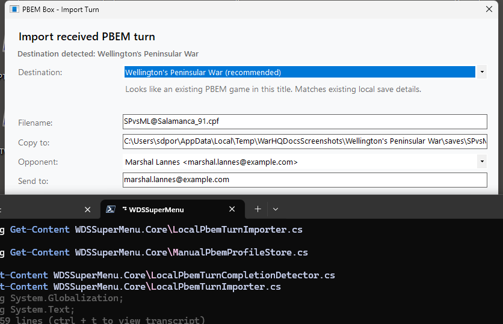
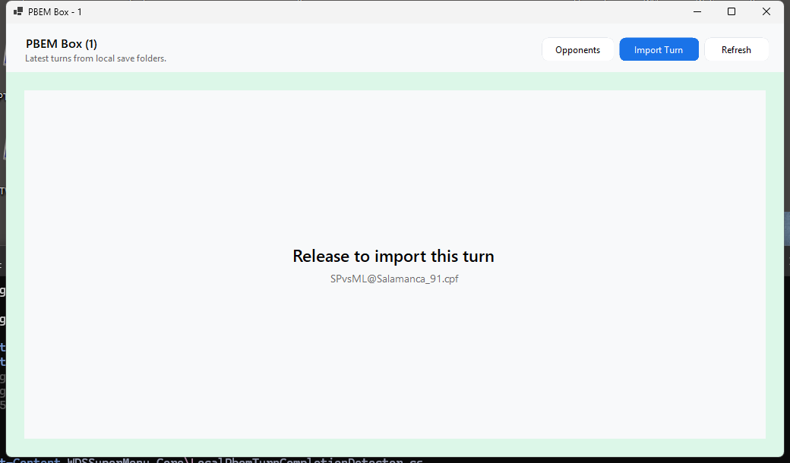
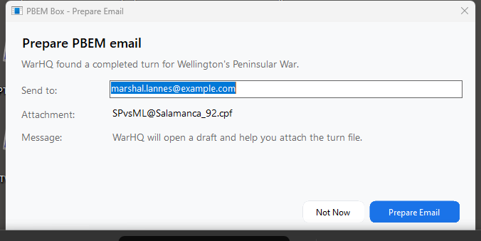
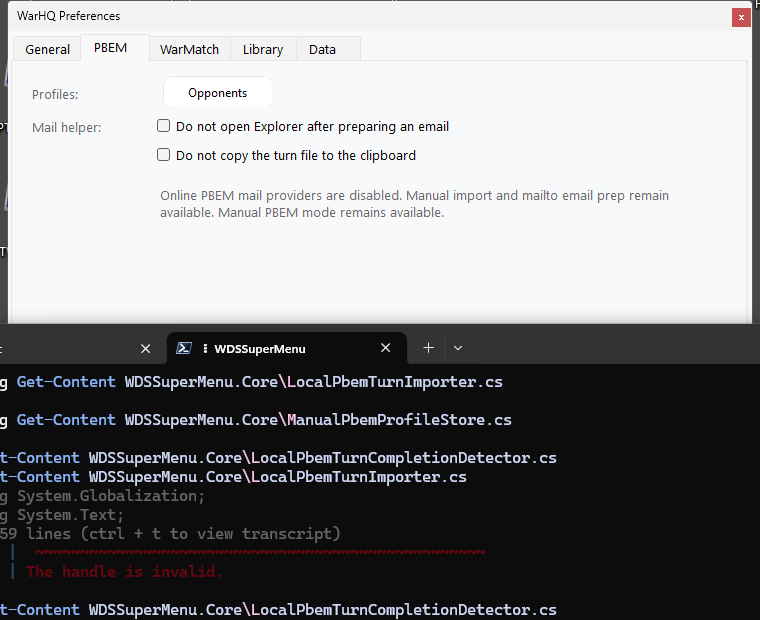

PBEM Box is for manual PBEM workflows where turns are sent by email, cloud drive, chat, or another service. It works with local WDS save files and your normal Windows email app; it does not require signing in to a mail account inside WarHQ.

## Review local PBEM turns

Open **PBEM Box** from the Library toolbar. WarHQ scans the save folders for your installed WDS titles, finds supported PBEM files, and groups related files into PBEM threads.

PBEM Box shows the game, filename, scenario, turn number, last modified time, opponent assignment, and detection confidence when that information is available. Use a PBEM row to open the game, open the file location, copy the path, view file history, or assign an opponent.

## Import a received turn

Use **Import Turn** when you want to browse for a received file manually.

1. Open PBEM Box from the Library toolbar.
2. Click **Import Turn**.
3. Choose the received `.bte` or `.cpf` file.
4. Confirm the detected destination game.
5. Edit **Copy to** if you want a different destination filename.
6. Choose an existing opponent or create a new opponent if WarHQ asks.
7. Select **Open game after import** if you want to launch the WDS title immediately.
8. Click **Import**.

If the destination filename already exists, WarHQ asks whether you want to overwrite it or go back and change the destination name. Nothing is overwritten until you confirm the overwrite prompt.

## Drag and drop a received turn

You can also drag a received turn file directly onto PBEM Box.

1. Save the received turn attachment somewhere easy to find, such as Downloads or your desktop.
2. Drag one supported PBEM turn file into PBEM Box. WarHQ accepts `.bte` and `.cpf` files.
3. Wait for the green **Release to import this turn** overlay.
4. Release the mouse button.
5. Confirm the import options in the dialog that opens.

If WarHQ does not show the green overlay, check that you are dragging only one `.bte` or `.cpf` file.

The main Library can also accept supported turn files, but PBEM Box gives the clearest import feedback.

## Organize opponents

Open **Opponents** from PBEM Box to manage opponent names, email addresses, and filename aliases.

Use aliases when the opponent name in a filename is shorter or different from the name you use in WarHQ. During import, WarHQ can use saved aliases and filename patterns to suggest the opponent. If WarHQ needs help, choose an existing opponent or choose **New**. When an alias is needed for filename matching, WarHQ asks for the opponent's alias in the filename.

Opponent assignments help WarHQ group related files and prefill the **Send to** field when it prepares a return email.

## Play and detect your completed turn

Open a PBEM row to launch the correct WDS game. You can double-click the row, press Enter, or use the context menu.

When you launch a game from PBEM Box, WarHQ watches for a newly completed turn after the WDS game exits. If it detects an updated outgoing turn file, it asks whether you want to prepare a return email.

## Prepare an outgoing email

When WarHQ prepares an outgoing email, it asks Windows to open your default email app using `mailto:`. WarHQ can fill in the recipient, subject, and message body, but `mailto:` cannot attach files automatically.

To make attaching the turn easier, WarHQ can:

- Copy the completed turn file to the clipboard so you can paste it into the email draft.
- Open File Explorer with the completed turn file selected so you can drag it into the email draft.
- Show a status message in the active WarHQ or PBEM Box window so you know what it did.

If Windows has no default email app configured for `mailto:`, WarHQ shows a warning instead of silently failing.

## PBEM preferences

Open **Preferences > PBEM** to adjust PBEM Box helpers.

- Disable opening File Explorer if you do not want WarHQ to show the completed turn file after preparing mail.
- Disable copying the file to the clipboard if you prefer to attach files manually.

## Common PBEM Box flow

1. Receive a `.bte` or `.cpf` file from your opponent.
2. Import it through PBEM Box.
3. Confirm the destination and opponent.
4. Open the game from PBEM Box.
5. Play the turn, save, and exit the WDS game.
6. Let WarHQ prepare the email draft.
7. Attach the completed turn by pasting from the clipboard or dragging it from Explorer.
8. Review and send the message from your email app.
