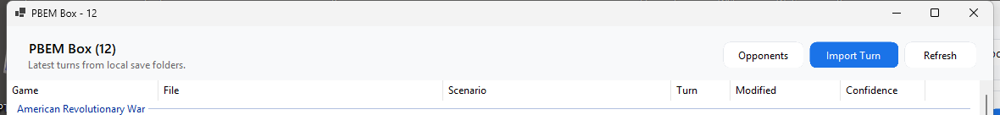

PBEM Box is for manual PBEM workflows where turns are sent by email, cloud drive, chat, or another service.

## Import a received turn

1. Open PBEM Box from the Library toolbar.
2. Choose the import action or drag a received turn file into WarHQ.
3. Select the destination game if WarHQ asks.
4. Keep the suggested backup option enabled when replacing an existing file.

## Prepare an outgoing turn

After you finish a PBEM turn, WarHQ can detect the updated save file and prepare an email draft. Review the recipient, subject, and attachment before sending.

## Organize opponents

Use opponent assignment when several files belong to the same PBEM match. This makes the PBEM list easier to scan and helps WarHQ group related files.
