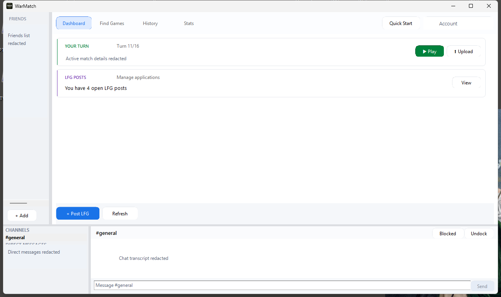

WarMatch is the cloud-backed PBEM flow in WarHQ. It helps players find opponents and exchange turns without manually attaching files to email.

## Sign in

1. Open WarMatch from the Library toolbar.
2. Create an account or sign in with your existing account.
3. Confirm that your display name looks right before contacting other players.

## Find a game

1. Browse available players or looking-for-game posts.
2. Pick the game title and scenario you want to play.
3. Send or accept a challenge.

## Exchange turns

When a cloud game is active, WarHQ can upload your completed turn and notify your opponent. Keep WarHQ running while playing if you want turn detection and notifications to happen automatically.

## Common checks

- Make sure both players own the same WDS title.
- Confirm both players are using the same scenario file.
- If a turn does not appear, check your internet connection and reopen WarMatch.
